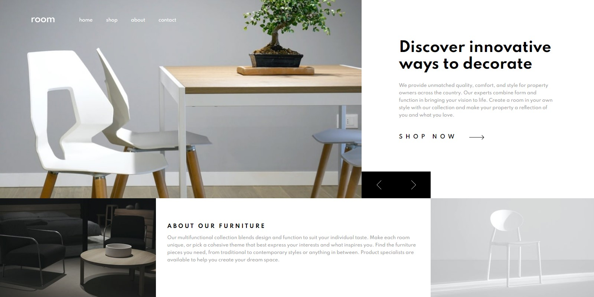

# Frontend Mentor - Room homepage solution

This is a solution to the [Room homepage challenge on Frontend Mentor](https://www.frontendmentor.io/challenges/room-homepage-BtdBY_ENq). Frontend Mentor challenges help you improve your coding skills by building realistic projects.

## Table of contents

- [Overview](#overview)
  - [The challenge](#the-challenge)
  - [Screenshot](#screenshot)
  - [Links](#links)
- [My process](#my-process)
  - [Built with](#built-with)
  - [What I learned](#what-i-learned)
  - [Continued development](#continued-development)
  - [Useful resources](#useful-resources)
- [Author](#author)
- [Acknowledgments](#acknowledgments)

## Overview

### The challenge

Users should be able to:

- View the optimal layout for the site depending on their device's screen size
- See hover states for all interactive elements on the page
- Navigate the slider using either their mouse/trackpad or keyboard

### Screenshot

### Links

- Solution URL: [solution URL](https://your-solution-url.com)
- Live Site URL: [live site](https://your-live-site-url.com)

## My process

### Built with

- Semantic HTML5 markup
- CSS custom properties
- Flexbox
- CSS Grid
- Mobile-first workflow
- SASS

### What I learned

In this practice, I learned about how to make an image slider or a slideshow using JavaScript.

### Continued development

In future projects, i would like to learn about an amazing animation for a slideshow.

### Useful resources

- [Slider tutorial](https://dev.to/code_mystery/image-slider-using-html-css-and-javascript-5dfn) - This helped me for making the slideshow.

## Author

- Website - [Abam](https://abams-website.vercel.app/)
- Frontend Mentor - [@Zulfaabam](https://www.frontendmentor.io/profile/Zulfaabam)
- Twitter - [@zabamz1](https://www.twitter.com/zabamz1)
- Instagram - [@zfaabam](https://www.instagram.com/zfaabam/)

## Acknowledgments
